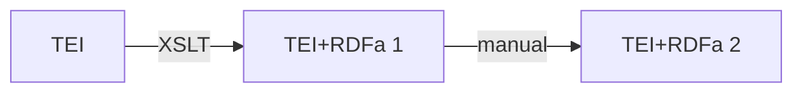

# attestationExample

Examples of attestations in various formats

## Notes concerning TEI + RDFa encoding

### Motivations

RDFa and TEI may be used to encode the structure of an attestation dictionary entry.

We claim that there is some advantages in using RDF to encode such data, as it allows for easier interoperability (with RDF, interconnection with external data comes out of the box).

However, we do not advocate for a drastic change in usual DH pipelines where TEI is a de facto standard. Instead, we claim that, while taking advantage of the usual pipeline, it is also possible to smoothly transition to RDF and take advantages of its strong points.

For this, we experiment TEI+RDFa to encode metadata on an example entry.

TEI is used to tag the tree structure of the entry and RDFa is used to embed RDF data inside the TEI document.

### What is this repo

- geargadas.rdf file gives an example of the RDF encoding of the entry
- geargadas.xml file gives an example of the TEI encoding of the same entry
- geargadas-rdfa file gives an example of the resulting TEI + RDFa file mixing both structures

### How to obtain the TEI+RDFa file

1. There is data that is redundant and available in both files. This is mainly the structure of the entry.
2. There is data that is available in TEI only form. This is mainly the fine editorial data that is obtained by tagging all parts of the original entry.
3. There is data that is available only in RDF format. That is mainly references to external entities (e.g. the books, corpora, etc. entities that are supposed to be described externally). WHAT ELSE ?

Data in TEI is given (TEI only and redundant data).

Redundant data in RDF may be obtained by an XSLT that adds RDFa annotation to the given TEI file.

RDF only data can be added to the resulting file subsequently.



### Some elements available in the files

#### Cited works

In TEI, citations refer to cited works (books, collected documents, etc.). In order to encode the data in TEI, these cited works are described in the TEI header and the xml:id are used for reference.

In RDF and Linked Data perspective, the cited works description does not have to be described in the resulting file. Indeed, cited works description is usually independent of the data which cites them. Hence in RDF encoding, we may only use the correct URI to inherit all known metadata about these cited works (even metadata that is not available in the original TEI doc).

--> this leads to better modularity in the data.

##### Example  

In the original TEI, we describe the different books and collected document from which citations are extracted.

```xml
<bibl xml:id="Exon_Th" type="corpus">
	<title>Codex Exoniensis</title>
	<note type="description" xml:lang="en">A collection of Anglo-Saxon poetry
		from a MS. in the library of the Dean and Chapter of Exeter by Benjamin
		Thorpe, London, 1842. Quoted at first by folio and by page and line,
		later by page and line</note>
</bibl>
<bibl xml:id="Beo_Th" type="corpus">
	<title>The Anglo-Saxon Poems of Beowulf</title>
	<editor>Benjamin Thorpe</editor>
	<placeName>Oxford</placeName>
	<date>1855</date>
</bibl>
```

Here, we do not know that the _Codex Exoniensis_ corpus is a collected document, while _The Anglo-Saxon Poems of Beowulf_ is a book. So we cannot take such knowledge into account.

Such additional information may be available in the Linked Data Cloud.

By using RDF, we can very easily take advantages of additional information available in the cloud.

NOTE: in the resulting RDF, such description of cited work will certainly not be present, but an external URI will be used.

#### Why should we add redundant data in RDFa

One could validly ask why we should bother adding RDFa annotation to the TEI file when the data is already available in TEI. There are several reasons for this:

1. The TEI+RDFa file can be seen as a metamorphic file that can be processed by any XML/TEI tools AND RDF tools, without any tool to be tweaked or adapted. Hence, explicitly annotating data with RDFa allows for the use of RDF based tools without any further action.
2. Even if the data itself is already available in TEI, there is no particular reasons why RDF structure should follow the TEI one. Indeed, the RDF structure could be a full graph or a tree that does not span on the TEI tree structure.
3. The TEI encoding will usually annotate values as they where given in the original data (e.g. the string 'pl.' will be annotated as a number element). Determining the exact meaning of this value will be delegated to further tools in the data pipeline if necessary. In RDF, there is a tendency to avoid such "local" encodings and a will to standardize such values. Hence, it is possible in RDF to map the original value 'pl.' to the shared entity 'lexinfo:plural' that is fully defined in the LOD cloud.
